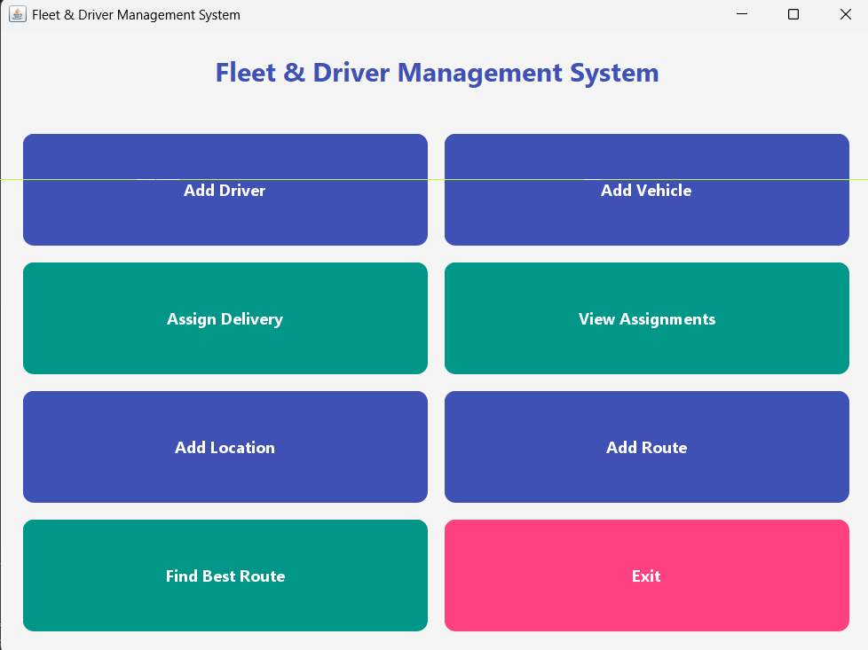

# Fleet & Driver Management System



A comprehensive Java-based application for managing fleet operations, drivers, vehicles, and delivery assignments with route optimization capabilities.

## 📋 Overview

This system provides an integrated solution for fleet management with two user-friendly interfaces:
- **Graphical User Interface (GUI)** - Modern, intuitive Swing-based interface
- **Command-Line Interface (CLI)** - Interactive terminal-based system

Perfect for logistics companies, delivery services, and fleet operators to manage their operations efficiently.

## ✨ Features

- **Driver Management**
  - Add and manage drivers
  - Track driver information and licenses
  - Assign drivers to deliveries

- **Vehicle Management**
  - Register vehicles in your fleet
  - Track vehicle details and availability
  - Assign vehicles to routes

- **Delivery Management**
  - Create and assign deliveries
  - Track delivery assignments
  - View all active deliveries

- **Location & Route Management**
  - Add locations to your network
  - Define routes between locations
  - Automatic route optimization
  - Find the best route for deliveries

- **Route Optimization**
  - Graph-based route calculation
  - Efficient pathfinding algorithms
  - Cost-effective delivery planning

## 🔧 Prerequisites

- **Java Development Kit (JDK)** - Version 8 or higher
- **Windows, Linux, or macOS** - Cross-platform compatible
- **No external dependencies** - Uses only Java standard libraries

## 🚀 Getting Started

### 1. Navigate to the Project Directory

```powershell
cd "path\to\FleetDriverMangement"
```

### 2. Compile the Project

From the `src` folder:

```powershell
cd src
javac *.java
```

### 3. Run the Application

```powershell
java Main
```

## 📖 Usage

### When You Launch the Application

You'll see a menu asking you to choose an interface:

```
===== Fleet & Driver Management System =====
Please choose an interface:
1. Graphical User Interface (GUI)
2. Terminal/Command Line
Enter your choice (1 or 2):
```

### Using the GUI (Option 1)

A modern window will open with buttons for:
- Add Driver
- Add Vehicle
- Assign Delivery
- View Assignments
- Add Location
- Add Route
- Find Best Route
- Exit

Simply click the buttons to perform operations.

### Using the Command-Line Interface (Option 2)

You'll see an interactive menu:

```
===== Fleet & Driver Management System =====
1. Add Driver
2. Add Vehicle
3. Assign Delivery
4. View Assignments
5. Add Location
6. Add Route between Locations
7. Find Best Route
8. Exit
Enter choice:
```

Follow the prompts to enter required information.

## 📁 Project Structure

```
FleetDriverMangement/
├── src/
│   ├── Main.java                    # Entry point
│   ├── FleetManager.java            # Core fleet management logic
│   ├── FleetManagementGUI.java      # GUI implementation
│   ├── Driver.java                  # Driver class
│   ├── Vehicle.java                 # Vehicle class
│   ├── Assignment.java              # Delivery assignment class
│   ├── Route.java                   # Route class
│   ├── Location.java                # Location class
│   ├── Transport.java               # Transport management
│   ├── LocationGraph.java           # Graph structure for route optimization
│   └── Person.java                  # Base person class
└── README.md                        # This file
```

## 🔑 Key Classes

| Class | Purpose |
|-------|---------|
| `Main` | Application entry point, manages interface selection |
| `FleetManager` | Core business logic for fleet operations |
| `FleetManagementGUI` | Graphical user interface using Swing |
| `Driver` | Represents a driver with license and details |
| `Vehicle` | Represents a vehicle in the fleet |
| `Assignment` | Manages delivery assignments |
| `LocationGraph` | Graph-based route optimization |
| `Route` | Defines routes between locations |

## 💡 Example Workflow

1. **Start the application** - Choose your preferred interface
2. **Add Drivers** - Create driver profiles with IDs and licenses
3. **Add Vehicles** - Register vehicles to your fleet
4. **Add Locations** - Define delivery locations
5. **Add Routes** - Create connections between locations
6. **Assign Deliveries** - Pair drivers and vehicles with deliveries
7. **Find Best Route** - Let the system optimize your delivery routes
8. **View Assignments** - Monitor all active deliveries

## 🎨 GUI Features

The graphical interface includes:
- Modern Material Design color scheme (Indigo, Teal, Pink)
- Styled buttons with hover effects
- Intuitive layout for easy navigation
- User-friendly dialogs for data input
- Clean display of information

## ⚙️ Technical Details

- **Language**: Java
- **GUI Framework**: Swing (javax.swing)
- **Design Pattern**: MVC (Model-View-Controller)
- **Data Structures**: Arrays, Lists, Graphs
- **Algorithms**: Graph traversal for route optimization

## 🛠️ Compilation & Execution

### Quick Command (from src directory)

```powershell
javac *.java && java Main
```

### Separate Steps

```powershell
# Compile
javac *.java

# Run
java Main
```

## 📝 Notes

- All data is managed in-memory during runtime
- The application supports both GUI and CLI modes seamlessly
- Routes are optimized using graph algorithms for efficiency
- No database configuration needed - works out of the box

## 🤝 Contributing

To extend the system:
1. Add new methods to `FleetManager.java` for business logic
2. Update `FleetManagementGUI.java` for GUI changes
3. Modify menu options in `Main.java` for CLI additions
4. Recompile with `javac *.java`

## 📞 Troubleshooting

| Issue | Solution |
|-------|----------|
| "javac command not found" | Install JDK and add to PATH |
| "Main class not found" | Ensure you're in src directory when running |
| GUI doesn't appear | Try CLI option, may be a display issue |
| Compilation errors | Ensure all .java files are in the same directory |

## 📄 License

Project created for fleet management operations.

---

**Version**: 1.0  
**Last Updated**: January 2026  
**Status**: Ready to Use
